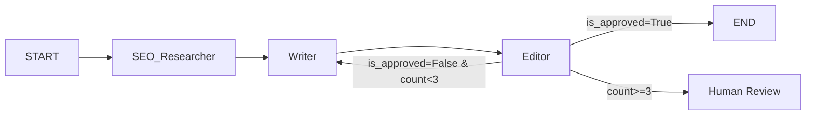

# 🚀 多智能体 SEO 内容编排系统 —— 开发计划（最终版）

## 项目概述

构建一个基于 LangGraph 的多智能体系统，自动生成符合 SEO 规范的日语内容。系统包含三个核心 Agent（SEO 研究员、日语主笔、审查编辑），通过反馈循环自动校验和优化输出质量。

### 系统架构



### 工具栈

| 类别 | 工具 |
|:---|:---|
| 包管理 | `uv` |
| 编排引擎 | `langgraph` |
| LLM 接口 | `langchain-openai` / `langchain-anthropic` / `langchain-google-genai` |
| 搜索引擎 | `tavily-python` |
| 可视化 | LangGraph Studio / `draw_mermaid_png()` |
| Tracing | LangSmith（推荐）/ Langfuse |
| 前端 | Streamlit |
| 术语库 | JSON（V1）→ ChromaDB（V2） |

---

## 📅 阶段 1：需求定义与架构骨架（Day 1）

**目标**：定义系统的输入/输出数据结构，搭建项目骨架，确保开发环境和 Tracing 工具就绪。

### 1.1 定义 Output Schema

| 子步骤 | 操作 | 产出文件 |
|:---|:---|:---|
| 1.1.1 | 创建 `src/schemas/output.py`，定义 `SEOArticleOutput` Pydantic 模型 | `src/schemas/output.py` |
| 1.1.2 | 为每个字段添加 `Field(description=...)` ，方便 LLM 理解字段含义 | 同上 |
| 1.1.3 | 编写字段校验器：`seo_score` 范围 0-100，`meta_title` 长度 ≤ 60 字符 | 同上 |

### 1.2 定义 GraphState

| 子步骤 | 操作 | 说明 |
|:---|:---|:---|
| 1.2.1 | 创建 `src/schemas/state.py`，定义 `GraphState` TypedDict | — |
| 1.2.2 | 确定**输入字段**：`topic: str`、`target_audience: str`、`keywords_preference: list[str]` | 用户传入 |
| 1.2.3 | 确定**中间态字段**：`keywords: list[str]`、`competitor_insights: str`、`draft_markdown: str`、`feedback: str` | 节点间流转 |
| 1.2.4 | 确定**控制字段**：`is_approved: bool`、`revision_count: int`、`reviewer_notes: str`、`seo_score: int` | 循环控制 |
| 1.2.5 | 所有字段设为 `Optional`，避免图启动时因字段缺失报错 | — |

### 1.3 搭建项目目录结构

| 子步骤 | 操作 | 产出 |
|:---|:---|:---|
| 1.3.1 | 创建目录骨架：`src/nodes/`、`src/schemas/`、`src/tools/`、`src/graph/`、`tests/`、`data/` | 目录结构 |
| 1.3.2 | 创建 `.env.example`，列出所有必须的 API Key：`OPENAI_API_KEY`、`TAVILY_API_KEY`、`LANGCHAIN_API_KEY` 等 | `.env.example` |
| 1.3.3 | 创建 `.env`（本地使用，加入 `.gitignore`），填入真实 Key | `.env` |
| 1.3.4 | 创建 `src/__init__.py` 及各子目录 `__init__.py` | 包结构 |

### 1.4 搭建最小 Graph

| 子步骤 | 操作 | 产出文件 |
|:---|:---|:---|
| 1.4.1 | 创建 `src/graph/graph.py`，实现 `DummyNode`：打印收到的 State、返回原 State | `src/graph/graph.py` |
| 1.4.2 | 用 `StateGraph(GraphState)` 组装 `START → DummyNode → END` | 同上 |
| 1.4.3 | 创建 `main.py` 入口：加载 `.env`，调用 `graph.invoke({"topic": "テストトピック"})` | `main.py` |
| 1.4.4 | 运行 `uv run python main.py`，确认图能跑通、State 打印正确 | — |

### 1.5 接入 Tracing（LangSmith）

| 子步骤 | 操作 | 说明 |
|:---|:---|:---|
| 1.5.1 | 在 `.env` 中设置 `LANGCHAIN_TRACING_V2=true`、`LANGCHAIN_PROJECT=seo-agent` | — |
| 1.5.2 | 重新运行 `main.py`，打开 LangSmith 控制台，确认出现对应 Trace | — |
| 1.5.3 | 验证 Trace 中能看到 DummyNode 的输入 / 输出和耗时 | — |

### 核心数据结构

```python
from pydantic import BaseModel, Field
from typing import Optional

class SEOArticleOutput(BaseModel):
    """系统最终输出结构"""
    meta_title: str              = Field(description="SEO 标题，≤60字符")
    meta_description: str        = Field(description="Meta 描述，70-160字符")
    target_keywords: list[str]   = Field(description="目标关键词列表")
    h1: str                      = Field(description="H1 标题")
    content_markdown: str        = Field(description="正文 Markdown")
    seo_score: int               = Field(ge=0, le=100, description="0-100 SEO 评分")
    revision_count: int          = Field(description="本稿修订次数")
    reviewer_notes: str          = Field(description="Editor 最终备注")
```

> **DoD**：`uv run python main.py` 能跑通一个最小化的 `START → DummyNode → END` Graph，且在 LangSmith 中可以看到 Trace，State 字段定义通过 `mypy` 或 `pydantic` 校验无报错。

---

## 📅 阶段 2：三核心节点原子化开发（Day 2-3）

**目标**：让三个核心 Agent 能独立工作，严格输出结构化 JSON。

**关键原则**：每个节点先用 `FakeLLM` 跑通，再换真 LLM。

| 节点 | 输入 | 输出 | 关键技术 |
|:---|:---|:---|:---|
| `SEO_Researcher` | topic, target_audience | keywords, competitor_insights | Tavily / Serper API 搜索 |
| `Writer` | keywords, feedback（可选） | draft_markdown | 日语 System Prompt + `.with_structured_output()` |
| `Editor` | draft, keywords, terminology_db | is_approved, feedback, seo_score | 结构化评估 Prompt |

### 2.1 SEO_Researcher 节点

| 子步骤 | 操作 | 说明 |
|:---|:---|:---|
| 2.1.1 | 创建 `src/nodes/researcher.py`，定义节点函数签名 `researcher_node(state: GraphState) -> dict` | — |
| 2.1.2 | 定义 `ResearchOutput` Pydantic 模型：`keywords: list[Keyword]`、`competitor_insights: str`，其中 `Keyword` 含 `term / relevance_score / search_intent` 字段 | `src/schemas/output.py` |
| 2.1.3 | 用 `FakeListLLM` 先实现节点骨架，固定返回一批关键词，验证 State 更新正确 | — |
| 2.1.4 | 集成 `TavilySearchResults` Tool，构造搜索查询（topic + 日语关键词后缀）| — |
| 2.1.5 | 编写 Prompt：让 LLM 从 Tavily 返回的搜索摘要中提取并排序关键词 | — |
| 2.1.6 | 替换为真实 LLM（`gpt-4o-mini`），测试一个真实 topic，检查关键词质量 | — |

### 2.2 Writer 节点

| 子步骤 | 操作 | 说明 |
|:---|:---|:---|
| 2.2.1 | 创建 `src/nodes/writer.py`，定义 `writer_node(state: GraphState) -> dict` | — |
| 2.2.2 | 定义 `WriterOutput` Pydantic 模型：`draft_markdown: str`、`meta_title: str`、`meta_description: str`、`h1: str` | `src/schemas/output.py` |
| 2.2.3 | 编写日语 System Prompt：角色定义为"日本語SEOライター"，明确字数、语气、H2 结构要求 | `src/prompts/writer_prompt.py` |
| 2.2.4 | 实现 feedback 分支：State 中 `feedback` 不为空时，Prompt 追加"以下の指摘を踏まえて修正してください"段落 | — |
| 2.2.5 | 用 `FakeListLLM` 跑通节点（首次创作 + 带 feedback 修订两个路径） | — |
| 2.2.6 | 绑定 `.with_structured_output(WriterOutput)` 强制输出结构化 JSON | — |
| 2.2.7 | 替换为真实 LLM，校验日语自然度和 Markdown 格式 | — |

### 2.3 Editor 节点

| 子步骤 | 操作 | 说明 |
|:---|:---|:---|
| 2.3.1 | 创建 `src/nodes/editor.py`，定义 `editor_node(state: GraphState) -> dict` | — |
| 2.3.2 | 定义 `EditorOutput` Pydantic 模型：`is_approved: bool`、`feedback: str`、`seo_score: int`、`reviewer_notes: str` | `src/schemas/output.py` |
| 2.3.3 | 编写评审 Prompt：明确列出评分维度（关键词密度 / Meta 规范 / H 标签 / 日语流畅度），以 JSON 格式返回结果 | `src/prompts/editor_prompt.py` |
| 2.3.4 | 用 `FakeListLLM` 跑通节点（返回 `is_approved=True` 和 `is_approved=False` 两种场景） | — |
| 2.3.5 | 为三个节点各编写单元测试（`tests/test_researcher.py`、`test_writer.py`、`test_editor.py`），以 FakeLLM 验证 State 字段更新是否正确 | `tests/` |

> **DoD**：三个节点均能独立接收 State 入参，返回更新后的 State 字典，`uv run pytest tests/` 全部通过。

---

## 📅 阶段 3：编排反馈循环（Day 4）—— 核心攻坚

**目标**：实现 Writer ↔ Editor 的"审查打回重写"闭环。

### 3.1 组装完整 Graph

| 子步骤 | 操作 | 说明 |
|:---|:---|:---|
| 3.1.1 | 在 `src/graph/graph.py` 中替换 DummyNode，将三个节点全部注册到 `StateGraph` | — |
| 3.1.2 | 添加固定边：`START → researcher → writer → editor` | — |
| 3.1.3 | 实现 `should_continue(state)` 路由函数，返回 `"end"` / `"revise"` / `"human_review"` 三条路径 | — |
| 3.1.4 | 用 `add_conditional_edges("editor", should_continue, {...})` 注册条件边 | — |
| 3.1.5 | 添加 `"human_review"` 占位节点：打印当前 State 并等待人工输入（`input()` 或 interrupt） | — |

### 3.2 revision_count 自增逻辑

| 子步骤 | 操作 | 说明 |
|:---|:---|:---|
| 3.2.1 | 在 Writer 节点内，每次执行时将 `state["revision_count"] + 1` 写回 State | 确保只有真正重写才计数 |
| 3.2.2 | 在 `GraphState` 中将 `revision_count` 默认值设为 `0` | — |
| 3.2.3 | 确认 `is_approved=True` 时 `revision_count` **不再**自增（Writer 未被调用） | — |

### 3.3 三条路径 FakeLLM 测试

| 子步骤 | 测试场景 | FakeLLM 配置 |
|:---|:---|:---|
| 3.3.1 | **路径 A（一次通过）**：Editor 首次返回 `is_approved=True` | FakeLLM 固定返回 approved JSON |
| 3.3.2 | **路径 B（打回2次后通过）**：Editor 前2次返回 `False`，第3次返回 `True` | FakeLLM 用序列固定返回 |
| 3.3.3 | **路径 C（超限走人工）**：Editor 连续返回 `False` 3次，触发 `human_review` 分支 | 同上 |
| 3.3.4 | 验证路径 C 后 `revision_count == 3` | assert 断言 |

### 3.4 可视化与集成验证

| 子步骤 | 操作 | 说明 |
|:---|:---|:---|
| 3.4.1 | 调用 `graph.get_graph().draw_mermaid_png()` 导出图拓扑图，确认节点和边正确 | `outputs/graph.png` |
| 3.4.2 | 换用 `gpt-4o-mini` 做首次真实 LLM 集成测试（1个 topic），检查节点间 State 传递无损 | — |
| 3.4.3 | 在 LangSmith 中检查完整 Trace，确认每个节点的输入/输出都可追溯 | — |

### 核心逻辑

```python
def should_continue(state: GraphState) -> str:
    if state["is_approved"]:
        return "end"
    if state["revision_count"] >= 3:
        return "human_review"  # 超限走人工介入
    return "revise"            # 打回重写
```

### 测试策略（防 Token 刺客）

| 阶段 | 模型 | 目的 |
|:---|:---|:---|
| 图逻辑调试 | `FakeListLLM`（固定返回 JSON） | 验证节点流转、路由、循环控制 |
| 集成测试 | `gpt-4o-mini` / `claude-3-haiku` / Ollama | 端到端跑通，验证 Prompt 基本效果 |
| 质量调优 | `gpt-4o` / `claude-3.5-sonnet` | 调优日语表达和 SEO 效果 |

> **DoD**：用 FakeLLM 验证 ✅ 路径 A / B / C 全部跑通；`draw_mermaid_png()` 导出图拓扑无误；`gpt-4o-mini` 集成测试跑通一条完整链路且 LangSmith 可见 Trace。

---

## 📅 阶段 4：专业化能力强化（Day 5）

**目标**：给 Agent 装上"领域专业知识"。

### 4.1 SEO 检查工具开发

| 子步骤 | 操作 | 产出文件 |
|:---|:---|:---|
| 4.1.1 | 创建 `src/tools/seo_checker.py` | `src/tools/seo_checker.py` |
| 4.1.2 | 实现 `check_keyword_density(text: str, keywords: list[str]) -> dict`：计算各关键词出现次数及密度，标记是否在 1-3% 区间 | 同上 |
| 4.1.3 | 实现 `check_meta_description(desc: str) -> dict`：校验长度（70-160字符）、是否包含主关键词 | 同上 |
| 4.1.4 | 实现 `check_headings(markdown: str) -> dict`：检查是否存在唯一 H1、H2 数量是否合理、关键词是否出现在 H1 中 | 同上 |
| 4.1.5 | 将三个函数封装为 `@tool` 装饰器修饰的 LangChain Tool | 同上 |
| 4.1.6 | 在 Editor 节点中绑定这三个 Tool，让 Editor 在评审前先调用工具获取客观指标 | `src/nodes/editor.py` |
| 4.1.7 | 为 `seo_checker.py` 编写单元测试（`tests/test_seo_checker.py`），覆盖边界情况（空文本、无关键词等） | `tests/test_seo_checker.py` |

### 4.2 本地术语库（V1：JSON）

| 子步骤 | 操作 | 产出文件 |
|:---|:---|:---|
| 4.2.1 | 创建 `data/terminology.json`，结构为 `[{"ja": "インテリア", "en": "interior", "context": "家具・内装"}]`，初始录入 30+ 条日语专业术语 | `data/terminology.json` |
| 4.2.2 | 在 `GraphState` 中加入 `terminology_db: list[dict]` 字段，图启动时从 JSON 文件加载 | `src/schemas/state.py` |
| 4.2.3 | 在 Editor 节点中实现 `check_terminology_coverage(draft, terminology_db) -> dict`：计算术语命中率，列出缺失术语 | `src/nodes/editor.py` |
| 4.2.4 | 将术语命中情况写入 Editor 的 `feedback`，格式为"以下の用語が本文中に見当たりません：〇〇、〇〇" | 同上 |

### 4.3 Writer Prompt 增强

| 子步骤 | 操作 | 产出文件 |
|:---|:---|:---|
| 4.3.1 | 创建 `src/prompts/writer_prompt.py`，将 System Prompt 抽取为可组合的模板函数 | `src/prompts/writer_prompt.py` |
| 4.3.2 | 在 Prompt 中注入 `terminology_db` 术语表：要求 Writer 在行文中自然融入术语 | 同上 |
| 4.3.3 | 在 Prompt 中加入写作风格指南：字数目标（1500-2000字）、标题句式、号召性语句惯例 | 同上 |
| 4.3.4 | 端到端测试：运行完整图，验证 Editor feedback 中包含"缺失术语"提示，且下一轮 Writer 输出中术语命中率提升 | — |

> **DoD**：`uv run pytest tests/test_seo_checker.py` 全部通过；Editor feedback 能明确列出缺失术语；Writer 修订稿中术语命中率 ≥ 80%。

---

## 📅 阶段 5：前端展示与持久化（Day 6-7）

**目标**：让项目看起来像一个成品。

### 5.1 Streamlit UI 开发

| 子步骤 | 操作 | 说明 |
|:---|:---|:---|
| 5.1.1 | 创建 `app.py`（Streamlit 入口），配置页面标题和 layout | `app.py` |
| 5.1.2 | 实现**输入区**：`st.text_input` 输入 topic 和 target_audience，`st.multiselect` 输入关键词偏好 | — |
| 5.1.3 | 将 graph 调用包装为 `run_graph(inputs)` 函数，使用 `graph.stream(inputs)` 逐节点流式迭代 | — |
| 5.1.4 | 用 `st.status` 容器展示节点执行进度：每当 stream 换到新节点时更新状态文字（"🔍 SEO調査中…" / "✍️ 執筆中…" / "📝 審査中…"） | — |
| 5.1.5 | 实现**结果区**：`st.markdown` 渲染最终正文，`st.metric` 展示 SEO 评分，`st.progress` 可视化评分条 | — |
| 5.1.6 | 实现**导出功能**：`st.download_button` 将最终 Markdown 导出为 `.md` 文件 | — |
| 5.1.7 | 添加**错误处理**：API Key 未配置时展示友好提示，而非抛出原始异常 | — |

### 5.2 持久化（SqliteSaver Checkpointer）

| 子步骤 | 操作 | 说明 |
|:---|:---|:---|
| 5.2.1 | 在 `src/graph/graph.py` 中引入 `SqliteSaver`，挂载到 Graph（`graph.compile(checkpointer=saver)`） | — |
| 5.2.2 | 每次用户提交任务时生成唯一 `thread_id`（`uuid4()`），写入 `st.session_state` | — |
| 5.2.3 | 将 `thread_id` 作为 `config={"configurable": {"thread_id": ...}}` 传入 `graph.stream()` | — |
| 5.2.4 | 在 Streamlit 侧边栏实现**历史任务列表**：读取 `data/checkpoints.db`，展示过去所有 thread_id 及其 topic | — |
| 5.2.5 | 实现**断点续传**：点击历史任务后，从 Checkpointer 恢复 State，可继续执行或仅查看结果 | — |

### 5.3 最终集成测试与收尾

| 子步骤 | 操作 | 说明 |
|:---|:---|:---|
| 5.3.1 | 完整跑通一次：从 Streamlit 输入 topic → 实时观察进度 → 导出 `.md` 文件 | — |
| 5.3.2 | 测试断点续传：中途关闭 Streamlit → 重新打开 → 从历史记录恢复 → 继续生成 | — |
| 5.3.3 | 更新 `README.md`：补充项目架构图、环境变量说明、`uv run streamlit run app.py` 启动命令 | `README.md` |

> **DoD**：`uv run streamlit run app.py` 正常启动；输入 topic → 实时进度展示 → 获得最终 SEO 文章 → 成功导出 `.md`；断开后从历史列表可恢复任务。

---

## 🔑 贯穿全程的关键原则

1. **Output 驱动开发**：先定义最终输出结构，再反推每个节点的职责
2. **Tracing 优先**：从 Day 1 接入 LangSmith，全程可观测
3. **分层测试**：FakeLLM → mini 模型 → 大模型，控制开发成本
4. **写审分离**：Writer 只负责创作，Editor 只负责校验，职责清晰
5. **渐进增强**：术语库 JSON → RAG，前端 Streamlit → 可选 Next.js，按需演进

---

## 🔍 Check 模式 —— 开发进度验证

每完成一个阶段或子步骤，运行 `scripts/check.py` 验证 DoD 是否满足，替代手动逐项确认。

### 用法

```bash
# 检查全部阶段（显示总进度）
uv run python scripts/check.py

# 只检查指定阶段（开发中常用）
uv run python scripts/check.py --stage 1
uv run python scripts/check.py --stage 2
```

### 输出说明

| 符号 | 含义 |
|:---|:---|
| `✅ PASS` | 该检查项已完成且验证通过 |
| `❌ FAIL` | 文件存在但逻辑有误（附错误说明） |
| `⏳ TODO` | 尚未实现（正常，按阶段推进即可） |

### 各阶段检查覆盖范围

| 阶段 | 检查项数 | 主要覆盖内容 |
|:---|:---|:---|
| 阶段 1 | 13 项 | `SEOArticleOutput` 字段/校验器、`GraphState` 字段完整性、目录结构、最小 Graph 可运行、LangSmith 配置 |
| 阶段 2 | 4 项 | 三节点文件存在且导出正确函数名、FakeLLM 测试文件存在 |
| 阶段 3 | 2 项 | 完整 Graph 节点注册、`should_continue` 三条路径路由正确 |
| 阶段 4 | 2 项 | SEO 检查工具三函数存在、术语库 JSON ≥10 条 |
| 阶段 5 | 2 项 | Streamlit `app.py` 含 `st.status`、SqliteSaver 已集成 |

> **注意**：阶段 1.5.2（Tracing 环境变量）需在加载 `.env` 后运行才能通过，可用 `python-dotenv` 预加载或临时 export：
> ```bash
> export $(grep -v '^#' .env | xargs) && uv run python scripts/check.py --stage 1
> ```
