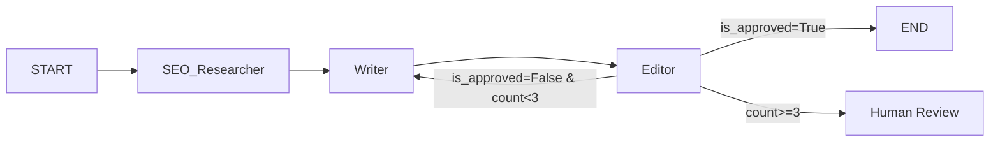

# 🚀 多智能体 SEO 内容编排系统 —— 开发计划（最终版）

## 项目概述

构建一个基于 LangGraph 的多智能体系统，自动生成符合 SEO 规范的日语内容。系统包含三个核心 Agent（SEO 研究员、日语主笔、审查编辑），通过反馈循环自动校验和优化输出质量。

### 系统架构



### 工具栈

| 类别 | 工具 |
|:---|:---|
| 包管理 | `uv` |
| 编排引擎 | `langgraph` |
| LLM 接口 | `langchain-openai` / `langchain-anthropic` / `langchain-google-genai` |
| 搜索引擎 | `tavily-python` |
| 可视化 | LangGraph Studio / `draw_mermaid_png()` |
| Tracing | LangSmith（推荐）/ Langfuse |
| 前端 | Streamlit |
| 术语库 | JSON（V1）→ ChromaDB（V2） |

---

## 📅 阶段 1：需求定义与架构骨架（Day 1）

**目标**：定义系统的输入/输出数据结构，搭建项目骨架，确保开发环境和 Tracing 工具就绪。

| 步骤 | 任务 | 要点 |
|:---|:---|:---|
| 1.1 | **定义 Output Schema** | 先敲定最终输出结构 `SEOArticleOutput`，反推每个节点的职责 |
| 1.2 | **定义 `GraphState`** | 包含 Input/中间态/Output 所有字段（TypedDict + Pydantic） |
| 1.3 | **环境搭建** | `uv init` + `uv add langgraph langchain pydantic tavily-python` |
| 1.4 | **搭建最小 Graph** | `START → DummyNode → END`，验证环境 OK |
| 1.5 | **接入 Tracing** | 配置 LangSmith（或 Langfuse），确保每次调用可追踪 |

### 核心数据结构

```python
from pydantic import BaseModel

class SEOArticleOutput(BaseModel):
    """系统最终输出结构"""
    meta_title: str              # SEO 标题
    meta_description: str        # Meta 描述
    target_keywords: list[str]   # 目标关键词
    h1: str                      # H1 标题
    content_markdown: str        # 正文 Markdown
    seo_score: int               # 0-100 评分
    revision_count: int          # 修订次数
    reviewer_notes: str          # Editor 最终备注
```

> **DoD**：`uv run python main.py` 能跑通一个最小化的 `START → DummyNode → END` Graph，且在 LangSmith 中可以看到 Trace。

---

## 📅 阶段 2：三核心节点原子化开发（Day 2-3）

**目标**：让三个核心 Agent 能独立工作，严格输出结构化 JSON。

**关键原则**：每个节点先用 `FakeLLM` 跑通，再换真 LLM。

| 节点 | 输入 | 输出 | 关键技术 |
|:---|:---|:---|:---|
| `SEO_Researcher` | topic, target_audience | keywords, competitor_insights | Tavily / Serper API 搜索 |
| `Writer` | keywords, feedback（可选） | draft_markdown | 日语 System Prompt + `.with_structured_output()` |
| `Editor` | draft, keywords, terminology_db | is_approved, feedback, seo_score | 结构化评估 Prompt |

### 各节点设计要点

**SEO_Researcher**
- 集成 Tavily API，根据主题搜索关键词和竞品内容
- 输出结构化的关键词列表（含搜索量、竞争度等维度）

**Writer**
- 使用精心设计的日语 System Prompt，确保表达地道
- 接收 Editor 的 feedback 时能针对性修改（而不是从头重写）
- 使用 `.with_structured_output(PydanticModel)` 强制输出格式

**Editor**
- 独立于 Writer 的评审节点，职责：SEO 合规检查 + 术语命中 + 日语自然度
- 输出 `{is_approved: bool, feedback: str, seo_score: int}`
- 将"写"和"审"解耦，极大提高修改质量

> **DoD**：三个节点均能独立接收 State 入参，返回更新后的 State 字典，且有 FakeLLM 单元测试通过。

---

## 📅 阶段 3：编排反馈循环（Day 4）—— 核心攻坚

**目标**：实现 Writer ↔ Editor 的"审查打回重写"闭环。

### 核心逻辑

```python
def should_continue(state: GraphState) -> str:
    if state["is_approved"]:
        return "end"
    if state["revision_count"] >= 3:
        return "human_review"  # 超限走人工介入
    return "revise"            # 打回重写
```

### 安全机制
- `revision_count` 每次 Writer 重写时 +1
- 上限 3 次：超过后走**人工介入**分支（而不是强制结束丢弃结果）
- Editor 的 `feedback` 会透传给 Writer，确保修改有针对性

### 测试策略（防 Token 刺客）

| 阶段 | 模型 | 目的 |
|:---|:---|:---|
| 图逻辑调试 | `FakeListLLM`（固定返回 JSON） | 验证节点流转、路由、循环控制 |
| 集成测试 | `gpt-4o-mini` / `claude-3-haiku` / Ollama | 端到端跑通，验证 Prompt 基本效果 |
| 质量调优 | `gpt-4o` / `claude-3.5-sonnet` | 调优日语表达和 SEO 效果 |

> **DoD**：用 FakeLLM 验证 ✅ 通过 → 正常结束、✅ 打回重写最多 3 次、✅ 超限走人工介入，三种路径均跑通。

---

## 📅 阶段 4：专业化能力强化（Day 5）

**目标**：给 Agent 装上"领域专业知识"。

### SEO 检查工具
- 编写 Python 函数：关键词密度检查、标题/H 标签校验、Meta 描述长度校验
- 作为 Tool 挂载到 Editor 节点

### 本地化术语库（V1 → V2 演进路线）
- **V1**：本地 JSON 术语字典（如 Coohom 相关日语专业术语）
  - Editor 节点加入**术语命中率校验**逻辑
  - Writer 的 System Prompt 注入术语表
- **V2（未来）**：升级为向量知识库（ChromaDB/FAISS）
  - 灌入术语库 + 公司历史优质文章
  - Writer 创作前做语义检索（轻量级 RAG）

### Writer Prompt 增强
- System Prompt 注入公司写作风格指南
- 注入本地化常识（如日语 SEO 常见的表达习惯）

> **DoD**：Editor 能自动检测术语命中情况，并在 feedback 中明确指出缺失的术语。

---

## 📅 阶段 5：前端展示与持久化（Day 6-7）

**目标**：让项目看起来像一个成品。

### UI 开发（Streamlit）
- 输入区：主题、目标受众、关键词偏好
- 过程展示：用 `st.status` 实时展示各节点的执行进度
- 结果展示：最终文章 Markdown 渲染 + SEO 评分
- 导出功能：支持导出为 `.md` 文件

### 持久化（Checkpointer）
- 使用 LangGraph 的 `SqliteSaver` 实现断点续传
- 支持中断后继续生成、历史任务回溯

> **DoD**：用户能通过 Streamlit 界面输入主题 → 实时观察 Agent 协作过程 → 获得最终 SEO 文章 → 断开后可恢复。

---

## 🔑 贯穿全程的关键原则

1. **Output 驱动开发**：先定义最终输出结构，再反推每个节点的职责
2. **Tracing 优先**：从 Day 1 接入 LangSmith，全程可观测
3. **分层测试**：FakeLLM → mini 模型 → 大模型，控制开发成本
4. **写审分离**：Writer 只负责创作，Editor 只负责校验，职责清晰
5. **渐进增强**：术语库 JSON → RAG，前端 Streamlit → 可选 Next.js，按需演进
