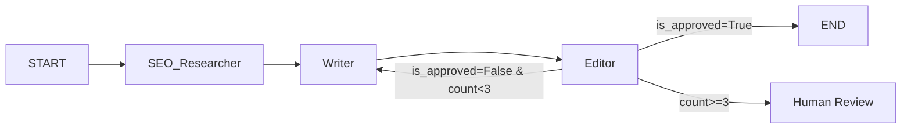

# 多智能体 SEO 内容编排系统 —— 深度评审 & 改进版 Plan V2

## 一、原计划亮点

Gemini 的计划路线清晰，阶段递进合理。特别好的地方有：
- **阶段划分科学**：State → 单体 Agent → 编排 → 增强 → UI，符合 LangGraph 的学习曲线
- **反馈循环的防死循环设计**（`revision_count` 上限）是实战中最容易踩的坑
- **术语库**的思路非常契合日语 SEO 场景的需求

---

## 二、核心问题与修改建议

### 🔴 问题 1：缺少独立的 Editor/Reviewer 节点

**现状**：阶段 2 只有 SEO 专家和文案两种角色，阶段 3 的"打回重写"逻辑没有明确由谁来执行审查。

**建议**：拆出专门的 **Editor 节点**，职责边界更清晰：

```
SEO_Researcher → Writer → Editor ──(pass)──→ End
                   ↑         │
                   └─(fail)──┘
```

- `SEO_Researcher`：检索关键词 + 竞品分析
- `Writer`：基于关键词撰写日语内容
- `Editor`：独立校验 SEO 合规 + 术语命中 + 日语自然度，输出 `{is_approved, feedback, seo_score}`

> 将"写"和"审"分离到不同 Agent，能显著提升修改质量——Writer 只关注创作，Editor 只关注校验。

---

### 🔴 问题 2：没有测试策略，存在"Token 刺客"风险

**现状**：没有提到如何在开发过程中避免大量消耗 LLM Token。

**建议**：分层测试策略：

| 测试层级 | 用途 | 模型选择 |
|:---|:---|:---|
| **图逻辑测试** | 验证节点流转、路由、循环控制 | Mock LLM（固定返回 JSON） |
| **集成测试** | 端到端跑通 | `gpt-4o-mini` / `claude-3-haiku` / 本地 Ollama |
| **质量调优** | 日语表达和 SEO 效果 | `gpt-4o` / `claude-3.5-sonnet` |

> **实操建议**：在阶段 2-3 开发时，写一个 `FakeLLM` 类（LangChain 内置有 `FakeListLLM`），直接用它跑通整个 Graph 再上真模型。

---

### 🟡 问题 3：工具链可以更现代

| 原方案 | 建议替换 | 理由 |
|:---|:---|:---|
| Poetry / Pipenv | **`uv`** | 速度快数十倍，社区趋势明显 |
| `grandalf` 终端绘图 | **LangGraph Studio** 或 `langgraph` 内置的 `draw_mermaid_png()` | 可视化效果更好，调试体验一流 |

---

### 🟡 问题 4：阶段 1 应前置"Output Schema"设计

在定义 `GraphState` 的同时，**必须先敲定最终输出结构**。否则后续每个节点不知道该往 State 里塞什么。

```python
class SEOArticleOutput(BaseModel):
    """系统最终输出的结构"""
    meta_title: str           # SEO 标题
    meta_description: str     # Meta 描述
    target_keywords: list[str]
    h1: str
    content_markdown: str     # 正文 Markdown
    seo_score: int            # 0-100
    revision_count: int
    reviewer_notes: str       # Editor 的最终备注
```

先定义终点，再反推每个节点需要产出什么。

---

### 🟡 问题 5：前端选型可以更灵活

Streamlit 适合快速原型，但如果目标是"看起来像成品"：
- **推荐 A**：继续用 Streamlit，但加上 `streamlit-agraph` 做流程可视化 + `st.status` 展示各节点的实时进度
- **推荐 B**：如果你想要更好的 UI 定制能力，可以考虑 **Next.js + FastAPI**，前后端分离，后端暴露 LangGraph 的流式输出 API

---

### 🟢 问题 6：术语库的进阶路径

原计划的 JSON 术语库是个很好的起点，建议规划好两阶段进化：

1. **V1（JSON）**：硬编码术语映射，Editor 检查命中率
2. **V2（RAG）**：将术语库 + 公司历史优质文章灌入向量库（如 Chroma/FAISS），Writer 在创作前先做语义检索，输出更贴近公司风格的内容

---

### 🟢 问题 7：补充可观测性（Observability）

多 Agent 系统调试非常痛苦，建议从一开始就接入 Tracing：
- **LangSmith**（LangChain 官方，免费额度足够 side project）
- 或者 **Langfuse**（开源自托管）

能看到每个节点的输入/输出、Token 消耗、延迟，对排查问题帮助巨大。

---

## 三、改进版 Plan V2

### 📅 阶段 1：需求定义与架构骨架（Day 1）

| 步骤 | 任务 | 要点 |
|:---|:---|:---|
| 1.1 | 定义 Output Schema | `SEOArticleOutput` Pydantic 模型 |
| 1.2 | 定义 `GraphState` | 包含 Input/中间态/Output 所有字段 |
| 1.3 | 环境搭建 | `uv init` + 安装 `langgraph`, `langchain`, `pydantic` 等 |
| 1.4 | 搭建最小 Graph | `START → DummyNode → END`，验证环境 OK |
| 1.5 | 接入 Tracing | 配置 LangSmith 或 Langfuse |

---

### 📅 阶段 2：三核心节点原子化开发（Day 2-3）

**关键原则**：每个节点先用 `FakeLLM` 跑通，再换真 LLM。

| 节点 | 输入 | 输出 | 关键技术 |
|:---|:---|:---|:---|
| `SEO_Researcher` | topic, target_audience | keywords, competitor_insights | Tavily/Serper API |
| `Writer` | keywords, feedback(可选) | draft_markdown | 日语 System Prompt + `.with_structured_output()` |
| `Editor` | draft, keywords, terminology_db | is_approved, feedback, seo_score | 结构化评估 Prompt |

> **DoD**：三个节点均能独立接收 State 入参，返回更新后的 State 字典，且有 FakeLLM 单元测试。

---

### 📅 阶段 3：编排反馈循环（Day 4）—— 核心攻坚



- **开发重点**：`should_continue` 条件边函数
- **安全机制**：`revision_count >= 3` 时走 **人工介入** 分支（而不是强制结束）
- **测试**：全程用 FakeLLM 或 mini 模型，打通整个图后再换大模型

---

### 📅 阶段 4：专业化能力强化（Day 5）

- **术语库 V1**：加载本地 JSON 术语字典，在 Editor 中加入术语命中率校验
- **SEO 检查工具**：关键词密度检查、标题/H 标签校验等 Python 规则函数
- **Writer Prompt 增强**：System Prompt 注入术语表 + 公司写作风格指南

---

### 📅 阶段 5：前端展示与持久化（Day 6-7）

- **UI**：Streamlit + `st.status` 实时展示各节点进度
- **持久化**：`SqliteSaver` 实现断点续传
- **输出**：支持导出最终 SEO 文章为 Markdown 文件

---

## 四、工具栈总结

| 类别 | 工具 |
|:---|:---|
| 包管理 | `uv` |
| 编排 | `langgraph` |
| LLM 接口 | `langchain-openai` / `langchain-anthropic` / `langchain-google-genai` |
| 搜索引擎 | `tavily-python` |
| 可视化 | LangGraph Studio / `draw_mermaid_png()` |
| Tracing | LangSmith（推荐）/ Langfuse |
| 前端 | Streamlit |
| 术语库 | JSON → 未来可演进到 ChromaDB |
